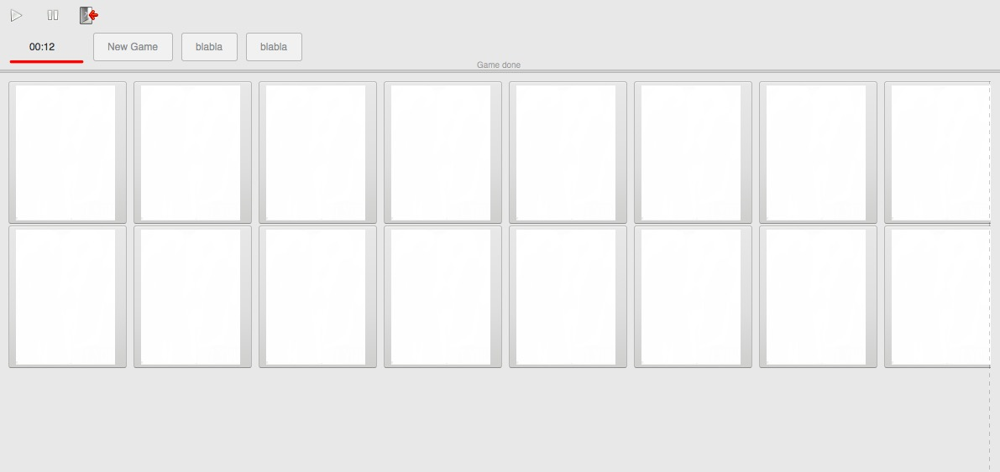

# memory_game
C++ graphical interface game with gtkmm library

to compile this programme you need install gtkmm library first, once the preparation finished, use this command to compile：

g++ -std=c++11 mywindow.cc buttons.cc matrix.cc waitthread.cc timerthread.cc main.cc -o main `pkg-config gtkmm-3.0 --cflags --libs`

execute:

./main

the preview of programme:

click "new game" to start, you can pause and continue.

there has a timer to record the time you spend.

if you pick two cards which have same color, they won't turn back.

else, they will turn back after several seconds.

once all cards are turned over，a popup window will be display and show your record.

of course you can add more function such as storing it in DB.
